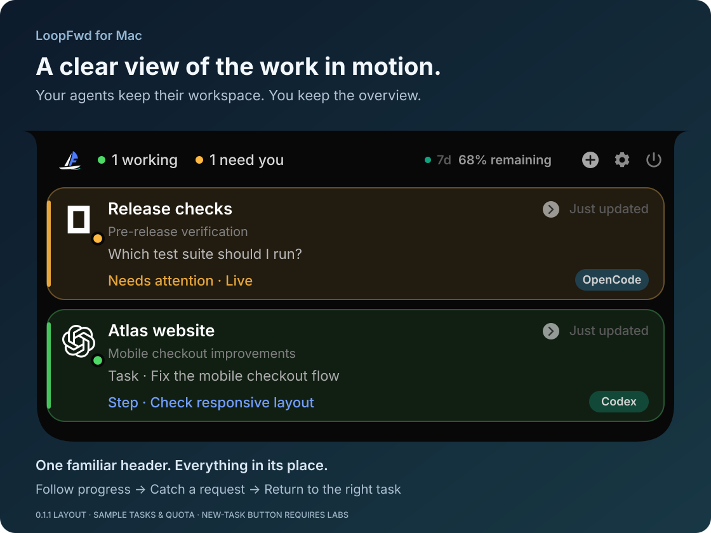

<p align="center">
  
</p>
<h1 align="center">LoopFwd for Mac</h1>
<p align="center"><strong>Keep your agents moving. Stop checking every window.</strong></p>
<p align="center">A native Mac island for following your AI tasks, catching requests, and getting back to work.</p>
<p align="center">
  <a href="https://github.com/pafa/LoopFwd-For-Mac/releases/tag/v0.1.1"><strong>Download the preview</strong></a> ·
  <a href="#see-it-in-26-seconds">Watch the film</a> ·
  <a href="#your-tools-together">Integrations</a> ·
  <a href="README.zh-CN.md">简体中文</a>
</p>
<p align="center">Apple Silicon · macOS 14+ deployment target · 0.1.1 Preview · MIT</p>

<p align="center">
  
</p>

*Illustrated preview, not an app screenshot. Sample tasks; capabilities depend on the integration.*

One agent is fixing a checkout. Another is waiting for a test choice. **You shouldn't have to open every conversation to find out.**
LoopFwd for Mac brings local tasks into one small island: what is running, what actually needs you, and where to return.
Your agents keep their own editors, terminals and conversations.

## Your tools, together

### Basic real-task evidence on these surfaces

<p align="center">
<picture>
    <source media="(prefers-color-scheme: dark)" srcset="docs/assets/agents/dark/openai.png">
    <source media="(prefers-color-scheme: light)" srcset="docs/assets/agents/light/openai.png">
    
  </picture>&nbsp;&nbsp;
<picture>
    <source media="(prefers-color-scheme: dark)" srcset="docs/assets/agents/dark/opencode.png">
    <source media="(prefers-color-scheme: light)" srcset="docs/assets/agents/light/opencode.png">
    
  </picture>&nbsp;&nbsp;
<picture>
    <source media="(prefers-color-scheme: dark)" srcset="docs/assets/agents/dark/githubcopilot.png">
    <source media="(prefers-color-scheme: light)" srcset="docs/assets/agents/light/githubcopilot.png">
    
  </picture>
</p>

<p align="center"><strong>Codex Desktop · OpenCode TUI HTTP · Copilot CLI</strong></p>

### Optional, experimental integrations

<p align="center">
<picture>
    <source media="(prefers-color-scheme: dark)" srcset="docs/assets/agents/dark/claude-color.png">
    <source media="(prefers-color-scheme: light)" srcset="docs/assets/agents/light/claude-color.png">
    
  </picture>&nbsp;&nbsp;
<picture>
    <source media="(prefers-color-scheme: dark)" srcset="docs/assets/agents/dark/gemini-color.png">
    <source media="(prefers-color-scheme: light)" srcset="docs/assets/agents/light/gemini-color.png">
    
  </picture>&nbsp;&nbsp;
<picture>
    <source media="(prefers-color-scheme: dark)" srcset="docs/assets/agents/dark/qwen.png">
    <source media="(prefers-color-scheme: light)" srcset="docs/assets/agents/light/qwen.png">
    
  </picture>&nbsp;&nbsp;
<picture>
    <source media="(prefers-color-scheme: dark)" srcset="docs/assets/agents/dark/kimi.png">
    <source media="(prefers-color-scheme: light)" srcset="docs/assets/agents/light/kimi.png">
    
  </picture>&nbsp;&nbsp;
<picture>
    <source media="(prefers-color-scheme: dark)" srcset="docs/assets/agents/dark/grok.png">
    <source media="(prefers-color-scheme: light)" srcset="docs/assets/agents/light/grok.png">
    
  </picture>
</p>

<p align="center"><strong>Claude Code CLI · Gemini CLI · Qwen Code · Kimi Code · Grok CLI</strong></p>

Eight integrations, enabled when you want them. Experimental integrations are off by default on fresh installs.
Monitoring, return and control are separate capabilities; even different surfaces of the same provider can differ.
[See what each integration can do](#compatibility-and-preview-notes).

## Follow the work. Catch the moment. Get back to it.

### 👀 Know the project, the task and the current step

Read **where the work belongs**, **what you asked for**, and **what is happening now** separately.
A short “continue” doesn't replace the actual goal. Expand for detail and scroll through more sessions—without a permanent list of idle chats.

### 🔔 Be notified when there is something to act on

Confirmed completions, failures and supported live requests can notify you.
A completed task appears briefly, then leaves the main list. **Done isn't a request for your approval.**
Choose event types, sounds and whether notification details are visible.

### 🧭 Return with the right expectation

Codex Desktop can take you back to the corresponding task.
Other sessions offer **Jump to task**, **Open App**, or an explanation when no return path is available.
Press **Control + G** to open the task switcher, select a session, and press Return; Escape dismisses it.

## See it in 26 seconds

https://github.com/user-attachments/assets/d4fdb119-f78b-47f4-b49e-13d833e83da7

[Download the selected launch film · 26 seconds, with sound](https://github.com/pafa/LoopFwd-For-Mac/releases/download/v0.1.0/LoopFwd-Launch-Selected-A-26s.mp4)

*Product demonstration. The current release's integration scope is listed below; the film is not evidence that every illustrated capability is verified.*

## 📊 Usage and allowance—with a source and a time

See Codex's **last reported usage, remaining allowance, reset time and data age**, when available.
Main Codex and Spark limits stay separate. Window labels follow the source report instead of assuming every plan has the same limits.

This is not a live balance query. Missing or old main-limit reports aren't presented as current allowance.
Optional Claude community estimates stay in Labs and are labeled as estimates, not official account data.

## Small details that make it feel like your Mac

<table>
<tr>
<td width="50%" valign="top"><h3>🖥️ Notch or external display</h3>Use the MacBook notch's sides, or reveal the island from a transparent top-center hot area on a display without one. Choose which display to use.</td>
<td width="50%" valign="top"><h3>🎛️ Your level of detail</h3>Choose Clean or Detailed style, panel width and height, and text size. Show model, branch, terminal, task summaries and checklists when the source provides them.</td>
</tr>
<tr>
<td width="50%" valign="top"><h3>🌐 English or 简体中文</h3>Follow macOS or choose your interface language. Restart to apply the choice; your original task text is never translated or rewritten.</td>
<td width="50%" valign="top"><h3>⌨️ A switcher within reach</h3>Open with <b>Control + G</b>, move between tasks and press Return. Choose the shortcut modifier that fits your setup.</td>
</tr>
<tr>
<td width="50%" valign="top"><h3>🎵 Sounds you actually want</h3>Choose sounds by event, preview them, import your own and set the volume. Quiet hours mute sound without hiding tasks that need attention.</td>
<td width="50%" valign="top"><h3>🌙 Set the rhythm</h3>Tune hover delay, collapse on mouse leave, event reveal and fullscreen visibility. Enable Launch at Login only if you want it.</td>
</tr>
<tr>
<td width="50%" valign="top"><h3>🔒 Keep notification details private</h3>Choose which events notify you and hide the details when needed. Completion can notify without automatically taking over the screen.</td>
<td width="50%" valign="top"><h3>🩺 Know when a source needs help</h3>Setup status shows available software, data and permissions. Diagnostics explains missing or stale sources; review its redacted report before sharing.</td>
</tr>
</table>

## Take the next step from the island · Labs

**Optional, experimental and off by default.** These controls appear only when the current session has a valid control path.

| Feature | Where it applies |
| --- | --- |
| 🚀 **Start a task** | Create a LoopFwd-managed Codex task. This does not take over your existing external sessions. |
| ✍️ **Send a follow-up or stop** | Continue or stop a managed Codex task. Turning Labs off doesn't stop existing tasks; quitting LoopFwd may affect them. |
| 💬 **Give a quick answer** | Answer a supported live OpenCode question, or use explicitly enabled, session-addressed Claude terminal controls. |
| ☑️ **Approve or decline** | Review supported live OpenCode or Claude requests. The actual request and control target must still be valid. |

**Not universal controls for all eight agents.** Codex CLI/Desktop observation doesn't provide live approval control.
Terminal.app is observation/return-only in 0.1.1; enabling Labs does not restore global keyboard injection.
[Read the setup and control conditions](docs/SETUP.md#setup-and-optional-observers).

## Local observation. Your connections. Your choice.

No LoopFwd cloud account, analytics or transcript uploads in the observation path.
Keep using your agents' own services; managed tasks still follow the provider's network behavior.
Hooks, observer setup and system permissions need your explicit action, with backups for configuration edits.

## Get started

1. **[Download the 0.1.1 preview](https://github.com/pafa/LoopFwd-For-Mac/releases/tag/v0.1.1)** and its matching checksum.
2. **Quit the old copy and drag LoopFwd into Applications.**
3. **Open Settings → Setup status**, enable the integrations you use, and continue working in your own tools.

This preview is ad-hoc signed, **not Apple-notarized**. If macOS blocks it, review the source and checksum, then use
**System Settings → Privacy & Security → Open Anyway** only if you trust it. Don't disable system-wide protection.

[Installation, custom directories and recovery](docs/SETUP.md) · [Build from source](docs/SETUP.md#build-from-source)

<details>
<summary><strong>A few good questions</strong></summary>

**Does it work without a notch?**

Yes. A transparent hot area at the top center reveals the island; you can choose the display.

**Can all integrations reply or approve?**

No. Observation, returning and control are separate. See the table below; optional controls stay in Labs.

**Will it run or stop my existing tasks?**

The default path observes your tools. Only explicitly created managed Codex tasks belong to LoopFwd's managed path; quitting may disconnect them.

**Why is a task or allowance missing?**

Data source, version, permissions and freshness matter. Start with Setup status, then Diagnostics. Use Choose CLI or select a custom data directory if needed.

**Do I need another account or subscription?**

No LoopFwd cloud account is required. The source is MIT-licensed and the current preview can be downloaded. Your agents' own accounts, subscriptions and model costs still apply.

</details>

## Fork it. Ask your agent. Make it yours.

**Keep the native island; adapt the parts that matter to you.**
Add a local observation source, improve a task summary, tune a display preference or contribute a translation.
A useful integration doesn't have to do everything: reliable observation alone is worth sharing.

<details>
<summary><strong>Copy a starting prompt for your coding agent</strong></summary>

```text
I forked LoopFwd for Mac. Make this focused change: [my workflow or need].
Read README, CONTRIBUTING and docs/ARCHITECTURE.md. Work on a task branch.
Reuse existing integrations and official interfaces; avoid unrelated rewrites.
State what can be observed, where a task can return, and what control is actually authorized.
Do not invent task state or turn process detection into approval authority.
Configuration edits require explicit actions, backups and recoverable errors.
Do not log in, buy credits or expand permissions without approval.
Run ./scripts/verify; smoke the real App for UI or packaging changes.
Open a focused PR with actual checks and limitations. Do not merge or publish it.
```

</details>

[Contribution guide](CONTRIBUTING.md#develop-with-your-own-agent) · [Request an integration](https://github.com/pafa/LoopFwd-For-Mac/issues/new/choose)

---

## Compatibility and preview notes

The current published download is **0.1.1**, an early preview, not a stable 1.0.
The previous [0.1.0 release](https://github.com/pafa/LoopFwd-For-Mac/releases/tag/v0.1.0) remains archived.
It has the same localized-resource startup risk fixed in 0.1.1; do not use it as a rollback for that fault.

macOS 14 is the deployment target. Current CI runs on macOS 26 and the local
development Mac is 26.6.2; a clean macOS 14 device run is not yet verified.
“Preview tested” means basic real-task monitoring on the named surface—not every capability,
account or environment. Installed software and parser tests alone do not earn that label.

| Integration | Preview scope and evidence | Main limitation |
| --- | --- | --- |
| Codex | Desktop monitoring, task links and completion notification checked | CLI and managed surfaces remain experimental; no CLI/Desktop approval observation |
| OpenCode | TUI HTTP 1.18.x: real dual sessions, progress, explicit completion, stop and question handling | Desktop read-only remains experimental; actual terminal return is not verified |
| Copilot CLI | 1.0.83: real progress, dual sessions, identity recovery, stop and explicit Autopilot completion | Ordinary reply end is not successful goal completion; app-only return, no approval control |
| Claude Code CLI | Optional registry/transcript reader and explicit attention hook | Real authenticated tasks not yet verified; controls stay in Labs |
| Gemini CLI | Optional 0.58.0 reader and progress observer | No confirmed completion or approvals; authenticated tasks not yet verified |
| Qwen Code | Optional 0.23.0 registry and progress observer | No confirmed completion or approvals; authenticated tasks not yet verified |
| Kimi Code | Optional 0.41.0 main-wire reader and lifecycle observer | No exact task return; authenticated tasks not yet verified |
| Grok CLI | Optional 1.0.13 / event-schema 1.0 reader | Authenticated tasks and actual return not yet verified |

Cursor Agent, DeepSeek Harness, Mistral Vibe, WorkBuddy and Doubao Work are
**not supported in 0.1.1**. Their state interfaces or setup/version costs are
not suitable for this first release. Retained source is not an active integration.

Capabilities vary by data source. Codex CLI/Desktop transcripts do not provide
live approval observation. An idle provider or an old assistant reply is not
evidence of successful completion. Unknown, stale and incompatible data are
reported as observation health, not invented task outcomes.

## Privacy, support and source

[Privacy](PRIVACY.md) · [Security](SECURITY.md) · [Setup & recovery](docs/SETUP.md) · [Contributing](CONTRIBUTING.md) · [Architecture](docs/ARCHITECTURE.md)

For a bug report, include the version/build, provider surface and a reviewed, redacted diagnostic report—not credentials or transcripts.
LoopFwd for Mac is [MIT-licensed](LICENSE) and is not affiliated with the providers it observes.
See [Third-party notices](THIRD_PARTY_NOTICES.md) for imported code, icon provenance and trademark boundaries.
