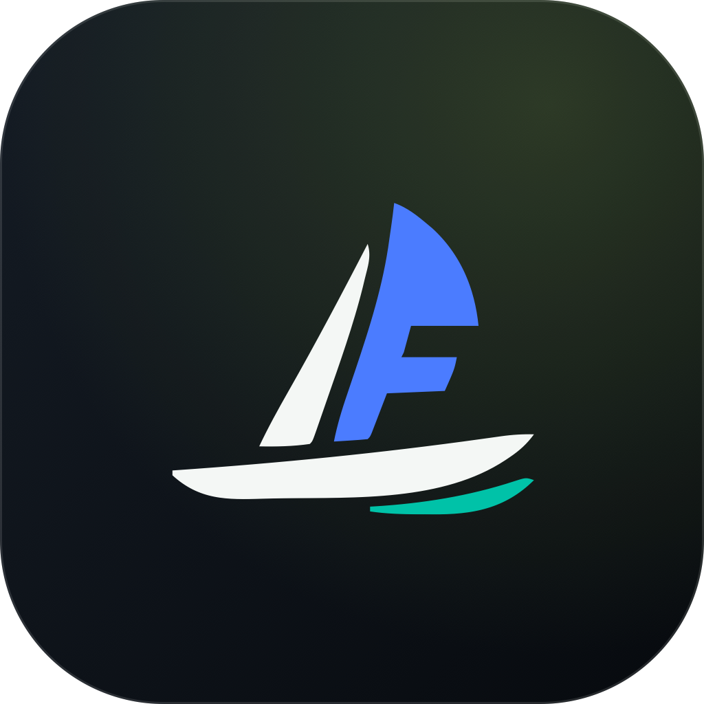

<p align="center">
  
</p>
<h1 align="center">LoopFwd for Mac</h1>
<p align="center"><strong>让 AI 继续工作，让你不必反复切窗。</strong></p>
<p align="center">Mac 顶部的一座小岛，看清多个 AI 任务的进展。</p>
<p align="center">
  <a href="https://github.com/pafa/LoopFwd-For-Mac/releases/tag/v0.1.0"><strong>下载 Mac 版</strong></a> ·
  <a href="#26-秒看懂它">观看宣传片</a> ·
  <a href="#让多任务工作更从容">了解功能</a> ·
  <a href="README.md">English</a>
</p>
<p align="center">Apple Silicon · macOS 14+ · 原生 SwiftUI + AppKit · MIT 开源</p>

一个 AI 在写代码，另一个在处理别的项目。你不需要不断切换窗口，确认“它还在运行吗？”
**LoopFwd for Mac** 将正在进行的任务放进一座随时可看的小岛：
看清正在做什么，及时发现需要你处理的事，再返回对应任务。
不用更换你习惯的 Agent、编辑器或终端。

## 26 秒看懂它

https://github.com/user-attachments/assets/d4fdb119-f78b-47f4-b49e-13d833e83da7

[下载宣传片 · 26 秒，含配乐](https://github.com/pafa/LoopFwd-For-Mac/releases/download/v0.1.0/LoopFwd-Launch-Selected-A-26s.mp4)

*已选定的产品宣传片；**0.1.0** 的实际接入范围见下方说明。*

## 让多任务工作更从容

<table>
<tr>
<td width="33%" valign="top"><h3>👀 多个任务，一眼掌握</h3>把不同工具、不同项目的活跃会话放在一起。想看细节就展开；任务变多时，继续滚动查看。</td>
<td width="33%" valign="top"><h3>🧩 不只知道“正在运行”</h3>分开看清<b>项目、任务、当前步骤</b>。“继续”“好的”不会覆盖真正的任务目标，更容易接上之前的工作。</td>
<td width="33%" valign="top"><h3>🔔 在有依据时提醒</h3>收到明确完成、失败和可观察的实时请求时提醒你。少一次反复确认，多一段属于自己的专注时间。</td>
</tr>
<tr>
<td width="33%" valign="top"><h3>🧭 少找窗口，更快返回</h3>按当前接入的实际能力返回。<b>准确跳转</b>和<b>仅打开应用</b>清楚区分；Codex Desktop 可返回对应任务。</td>
<td width="33%" valign="top"><h3>✅ 做完就让出位置</h3>完成任务只短暂展示，空闲任务不常驻。这里关注正在推进的工作，不把已完成记录堆成一张长清单。</td>
<td width="33%" valign="top"><h3>⌨️ 不离开键盘，也能切换</h3><b>Control + G</b> 打开任务切换器，继续切换会话，回车返回，Escape 收起。修饰键可按习惯选择。</td>
</tr>
</table>


## 按你的 Mac，调成你的习惯

<table>
<tr>
<td width="33%" valign="top"><h3>🖥️ 刘海屏与外接屏</h3>借用 MacBook 刘海两侧；无刘海屏通过顶部中心透明热区展开。可选显示器，也可切换简洁或详细样式。</td>
<td width="33%" valign="top"><h3>🎛️ 信息多少，你来决定</h3>调整面板宽高和字体。按需显示任务摘要、当前活动、模型、分支、终端和待办清单；数据由实际来源提供。</td>
<td width="33%" valign="top"><h3>🌐 中文、英文，自己选</h3>跟随系统，或在设置中明确选择简体中文与 English。切换的是界面语言，不会翻译或改写你的任务原文。</td>
</tr>
<tr>
<td width="33%" valign="top"><h3>🌙 配合你的工作节奏</h3>可调悬停延迟、离开收起、事件展开和全屏隐藏。提醒类型、通知详情隐藏、登录启动，都由你选择。</td>
<td width="33%" valign="top"><h3>🎵 提醒也可以有个性</h3>按事件选择声音、试听或导入自己的音效，调节音量。静音时段让夜间更安静，但不会隐藏真正待处理的任务。</td>
<td width="33%" valign="top"><h3>📊 额度与用量，随手可看</h3>有数据时展示 Codex 最近报告的使用情况、剩余额度、重置时间与数据时间。主 Codex 和 Spark 分开，不把本地报告说成实时余额查询。</td>
</tr>
</table>


## 下一步，也可以在岛内完成

可选 **Labs** 把常用小操作带到任务旁边。这些功能仍属实验、默认关闭，
只有当前会话具备有效控制通道时，才开放相应操作。

<table>
<tr>
<td width="33%" valign="top"><h3>🚀 下达任务</h3>从岛内创建 LoopFwd 托管的 Codex 任务，续发指令，或停止这项托管任务。不会把你已有的外部会话变成托管任务。</td>
<td width="33%" valign="top"><h3>💬 快捷回复</h3>不离开小岛，就能对支持的实时问题直接回答或选择选项。适用于 OpenCode 和单独开启的 Claude 终端控制。</td>
<td width="33%" valign="top"><h3>☑️ 快捷同意或拒绝</h3>看清实时请求，决定是否让 Agent 继续。适用于受支持的 OpenCode 和 Claude 请求；具体设置与权限条件见下方说明。</td>
</tr>
</table>

这些不是八款 Agent 全部通用的控制能力。不可用或无法核验的操作会保持禁用；
Codex CLI/Desktop 的观察接入不提供审批控制。具体条件放在下方设置说明中。

### 🔒 本地观察，有问题也说清楚

监控路径读取本机会话数据，不需要 LoopFwd 云端账户，不做遥测或上传完整对话。
Setup status 帮你了解接入是否可用；Diagnostics 说明数据缺失、过期等问题，
并提供脱敏报告便于反馈。权限申请与观察器安装都需要你的明确操作。

## 熟悉的工具，聚在一起

<p align="center">
  <picture>
    <source media="(prefers-color-scheme: dark)" srcset="docs/assets/agents/dark/openai.png">
    <source media="(prefers-color-scheme: light)" srcset="docs/assets/agents/light/openai.png">
    
  </picture>&nbsp;&nbsp;
  <picture>
    <source media="(prefers-color-scheme: dark)" srcset="docs/assets/agents/dark/opencode.png">
    <source media="(prefers-color-scheme: light)" srcset="docs/assets/agents/light/opencode.png">
    
  </picture>&nbsp;&nbsp;
  <picture>
    <source media="(prefers-color-scheme: dark)" srcset="docs/assets/agents/dark/githubcopilot.png">
    <source media="(prefers-color-scheme: light)" srcset="docs/assets/agents/light/githubcopilot.png">
    
  </picture>&nbsp;&nbsp;
  <picture>
    <source media="(prefers-color-scheme: dark)" srcset="docs/assets/agents/dark/claude-color.png">
    <source media="(prefers-color-scheme: light)" srcset="docs/assets/agents/light/claude-color.png">
    
  </picture>&nbsp;&nbsp;
  <picture>
    <source media="(prefers-color-scheme: dark)" srcset="docs/assets/agents/dark/gemini-color.png">
    <source media="(prefers-color-scheme: light)" srcset="docs/assets/agents/light/gemini-color.png">
    
  </picture>&nbsp;&nbsp;
  <picture>
    <source media="(prefers-color-scheme: dark)" srcset="docs/assets/agents/dark/qwen.png">
    <source media="(prefers-color-scheme: light)" srcset="docs/assets/agents/light/qwen.png">
    
  </picture>&nbsp;&nbsp;
  <picture>
    <source media="(prefers-color-scheme: dark)" srcset="docs/assets/agents/dark/kimi.png">
    <source media="(prefers-color-scheme: light)" srcset="docs/assets/agents/light/kimi.png">
    
  </picture>&nbsp;&nbsp;
  <picture>
    <source media="(prefers-color-scheme: dark)" srcset="docs/assets/agents/dark/grok.png">
    <source media="(prefers-color-scheme: light)" srcset="docs/assets/agents/light/grok.png">
    
  </picture>
</p>

**Codex · OpenCode · Copilot · Claude Code · Gemini · Qwen · Kimi · Grok**

首发包含 8 款接入，按需开启。前三款在指定运行表面有基础真实任务验证；
后五款为可选 **Experimental** 接入，新安装默认关闭。
[查看完整支持范围与当前限制](#兼容性与预览版说明)。

## Fork 它，让你的 Agent 帮你改成自己的工具

每个人的工作方式都不同，不必等一个统一版本满足所有需求。
**LoopFwd for Mac 采用 MIT 开源协议，你可以用自己习惯的编程 Agent 继续扩展它。**

| 🍴 从 Fork 开始 | 🤖 告诉 Agent 你的需要 | 🌱 把好改进分享回来 |
| --- | --- | --- |
| 保留原生小岛和你正在使用的接入。 | 增加一种本地工具、改进任务摘要、调整界面细节，或补充语言。 | 验证这个小改动后提交 PR，说明实际可用能力与限制。 |

不同接入可以有不同能力：本地会话记录用于描述任务，可靠的应用链接用于返回，
实时控制接口才用于回复。**不需要一次做全，一个可靠的小接入就有价值。**

<details>
<summary><strong>复制这段话，让你的 Agent 开始</strong></summary>

```text
我 Fork 了 LoopFwd for Mac，希望实现：[你的具体需求]。
先阅读 README、CONTRIBUTING 和 docs/ARCHITECTURE.md，在独立任务分支工作。
参考现有接入和官方接口，实现最小、可用的修改，不重写无关架构。
如果是新增 Agent，明确它能观察什么、能否准确返回，以及是否真的支持控制。
不要从历史回答猜测完成，不要把进程检测伪装成真实任务状态。
用户配置修改必须明确触发、先备份；不自动登录、购买额度或扩大权限。
补关键回归，运行 ./scripts/verify；界面变化另外做真实 App 冒烟。
提交一个聚焦的 PR，写清修改、验证和限制；不要自行合并或发布。
```

</details>

参阅[贡献指南与英文 Agent 提示词](CONTRIBUTING.md#develop-with-your-own-agent)。

## 开始使用

1. **[下载 0.1.0 预览版](https://github.com/pafa/LoopFwd-For-Mac/releases/tag/v0.1.0)** 及对应校验文件。
2. **拖入 Applications。** 替换旧版前，先退出正在运行的 LoopFwd。
3. **打开 Setup status**，开启你需要的接入，然后继续使用原有工具工作。

预览包采用 ad-hoc 签名，未经 Apple 公证。如果 macOS 阻止打开，请先核验下载来源，
再查看“**系统设置 → 隐私与安全性 → 仍要打开**”。不要关闭整个系统的安全保护。

---

## 兼容性与预览版说明

**0.1.0 是早期预览版，不是稳定 1.0。**
“预览实测”仅表示指定运行表面的基础任务监控做过真实验证，
不代表所有功能、账户或使用环境都已通过。已安装或解析测试通过，不等于真实任务已验证。

| 接入 | 首发范围与证据 | 主要限制 |
| --- | --- | --- |
| Codex | Desktop 监控、任务跳转、完成通知已实测 | CLI/托管表面仍为实验；CLI/Desktop 不观察实时审批 |
| OpenCode | TUI HTTP 1.18.x 的真实双会话、进展、明确完成、停止和提问 | Desktop 只读仍为实验；真实终端返回未验证 |
| Copilot CLI | 1.0.83 的真实进展、双会话、身份恢复、停止及明确 Autopilot 完成 | 普通回复结束不代表目标成功；只打开应用、不控制审批 |
| Claude Code CLI | 可选的登记/会话读取和明确注意力 Hook | 登录后的真实模型任务尚未验证；控制留在 Labs |
| Gemini CLI | 可选的 0.58.0 读取与进展观察器 | 不确认完成或审批；真实模型任务尚未验证 |
| Qwen Code | 可选的 0.23.0 登记与进展观察器 | 不确认完成或审批；真实模型任务尚未验证 |
| Kimi Code | 可选的 0.41.0 主 wire 与生命周期观察器 | 不承诺精确返回；真实模型任务尚未验证 |
| Grok CLI | 可选的 1.0.13 / 事件 schema 1.0 读取 | 真实模型任务和实际返回尚未验证 |

**0.1.0 暂不支持** Cursor Agent、DeepSeek Harness、Mistral Vibe、WorkBuddy 和豆包工作。
这些产品目前的状态接口或安装、版本维护成本不适合首发。保留代码不代表启用集成。

只有明确的成功边界才能显示完成。历史回答、非 busy、进程存在都不代表完成。
过期和不兼容属于观察健康，不代表任务要求用户决策。

<details>
<summary><strong>下载校验、安装与回退</strong></summary>

从 [0.1.0 发布页](https://github.com/pafa/LoopFwd-For-Mac/releases/tag/v0.1.0) 下载 ZIP 及同名 SHA-256 文件，在下载目录校验：
`shasum -a 256 -c <下载包文件名>.sha256`。
退出旧版，将解压后的 LoopFwd 拖入 Applications，再启动。

测试包采用 ad-hoc 签名，未经 Apple 公证。若系统拦截，请确认来源和校验和，
再按 **系统设置 → 隐私与安全性 → 仍要打开** 操作。
不要关闭整个系统的安全保护。源码开源不需要发布到 App Store。

目前手动更新；保留旧 ZIP 便于回退。退出可能影响 LoopFwd 托管的任务，
不会停止外部 Agent。

</details>

<details>
<summary><strong>从源码构建</strong></summary>

需要完整 **Xcode 26.6**、**Node 24+**、**Python 3.11+**、**jq** 和 **ripgrep**。Python 用于安装事务测试和显式 Kimi 观察器设置。LoopFwd 不安装或额外管理 Python 环境。
仅 Command Line Tools 不包含图标打包工具。

```sh
./scripts/preflight
./scripts/verify
open dist/LoopFwd.app
```

快速编译用 `swift build`，单独测试用 `swift test`。
构建和首次启动不自动修改 Provider 配置或申请系统权限。

</details>

<details>
<summary><strong>设置细节、可选观察器与开发版升级</strong></summary>

- 在“Setup status”检查软件、数据源和权限，不把安装状态当成验证结果。
- Finder 找不到 CLI 时，在 Agents 的“Choose CLI…”显式选择可执行文件。
- 新建托管任务、OpenCode 回复和审批位于 Labs，默认关闭。
- 关闭 Labs 不停止现有托管任务；仍可返回和停止。
- Claude 终端输入使用独立 Labs 开关；Hook 和 Observer 安装需明确点击。

跳转区分“准确返回任务”“仅打开应用”和“不可返回”。仅打开应用不会把任务标为已查看。

在“通用 → 界面语言”选择跟随系统、简体中文或 English。默认跟随 macOS；
显式选择在重启 LoopFwd 后生效，不修改系统语言。

Codex 额度来自本地报告，不是实时查询账户余额。主 Codex 与 Spark 的限额分别处理，
窗口名称以报告中的实际时长为准；缺失或过期的主额度报告不会显示为当前余量。

旧版 Claude Hook 需在“集成”中显式点击“更新 Hook”，增加事件产生时的进程身份。
更新前，无来源身份的旧事件不再触发待处理提醒；重启 LoopFwd 不会自动改写 Hook
或开启控制。更新前保留旧脚本备份。

## Gemini / Qwen 可选观察器

在“集成”安装 Gemini CLI **0.58.0** 或 Qwen Code **0.23.0** 的只读观察器。
选择该 CLI 存放 `settings.json` 的配置目录及 **Node 24+** 可执行文件。
只追加 LoopFwd 自有 Hook，保留 JSONC 注释、原有 Hook 和禁用设置。
随后重启 CLI；工作区信任仍由原产品决定。这里只观察进展，不授予审批能力，
也不保证能确认成功完成；两款仍为 Experimental。

LoopFwd 按官方 Node 重启关系找到实际运行进程，不把启动器当成额外会话。
Qwen 在登录前也可能登记会话；缺少匹配记录时只保留该稳定身份并标为“仅进程检测”，
不会借用历史任务或推断完成。已有观察器须显式“重新安装”才会更新进程匹配逻辑；
只重启 LoopFwd 不会覆盖你已安装的 Hook。

“重新安装”可补回丢失的观察器副本；“移除”不要求原 CLI 仍在，但仍需要 Node。
“显示备份文件夹”打开配置旁的 `.loopfwd-json-hooks`。安装被强制中断后，
可能残留 `transaction.lock`；先确认其中记录的安装进程已经结束，再将这一文件
移到别处保留并重试移除或重新安装。不要在安装器运行时移走锁。
手动恢复前对比备份与当前配置，避免覆盖后来修改；LoopFwd 不自动强行解除锁。

## Kimi 可选观察器

在“集成 → Kimi Code 观察器”选择实际 `KIMI_CODE_HOME` 目录、Node 24+
和 Python 3.11+。安装只读检查所选官方 npm 客户端为 **0.41.0**，不启动 Kimi；
备份 `config.toml` 后加入三个生命周期 Hook。移除不依赖 Kimi，重新安装可修复
丢失的脚本副本。请保留显示的备份目录；不兼容的 TOML Hook 写法和被手动修改的
托管配置块会原样保留并报错。

Kimi 每次写入后会关闭 wire 文件，观察器通过实际进程及出生身份绑定独立会话，
避免文件句柄关闭时漏报。心跳只证明会话归属，任务状态与进展仍来自对应的
主会话记录。官方 client identity 不能区分 TUI、Web 和 ACP，故不承诺精准任务
跳转、审批或控制。仍为 Experimental；构建或启动 LoopFwd 不会自动安装 Hook。

## 从开发版升级

暂缓项不再扫描或提供新安装入口，即使旧设置开启了它们也不会启用。
不会自动卸载原软件、观察器或删除会话、配置。此前安装的 Hook 可能仍由原产品
运行，关闭 LoopFwd 观察不等于卸载 Hook。若需移除或恢复，请保留前一个开发版
及其配置备份，使用其中原有移除入口。手动恢复前比较当前配置，避免覆盖后续修改。

</details>

## 隐私、反馈与开源

观察路径不做遥测、云同步或 transcript 上传。可选托管命令仍受 Provider
自己的执行和网络行为约束。分享 Diagnostics 前请检查，不提交密钥和完整对话。

参阅 [隐私](PRIVACY.md)、[安全](SECURITY.md)、[贡献说明](CONTRIBUTING.md)、
[架构](docs/ARCHITECTURE.md) 和 [第三方声明](THIRD_PARTY_NOTICES.md)。
LoopFwd 采用 [MIT](LICENSE)，与被监控的各品牌没有隶属关系。
