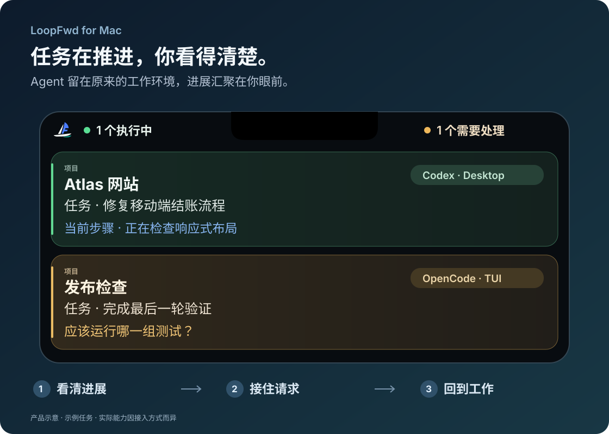

<p align="center">
  
</p>
<h1 align="center">LoopFwd for Mac</h1>
<p align="center"><strong>让 AI 继续推进，让你少些反复切窗。</strong></p>
<p align="center">Mac 顶部的任务监控小岛：看清进展，接住请求，回到工作。</p>
<p align="center">
  <a href="https://github.com/pafa/LoopFwd-For-Mac/releases/tag/v0.1.2"><strong>下载预览版</strong></a> ·
  <a href="#26-秒感受它">观看宣传片</a> ·
  <a href="#熟悉的工具先聚在一起">接入范围</a> ·
  <a href="README.md">English</a>
</p>
<p align="center">Apple Silicon · macOS 14+ 部署目标 · 0.1.2 预览版 · MIT 开源</p>

<p align="center">
  
</p>

*按 0.1.1 实际展开布局（无刘海显示器）绘制，并非 App 实机截图。任务与额度为示例；“＋”新建任务按钮需开启 Labs，实际能力取决于接入方式。*

一个 Agent 在修复结账流程，另一个在等你选择测试范围。**你不必逐个打开对话，才知道它们到了哪一步。**
LoopFwd for Mac 把本机任务汇聚到一座小岛：哪些还在推进，哪些真正需要你处理，下一步可以回到哪里。
Agent 继续留在你熟悉的编辑器、终端和对话里。

## 熟悉的工具，先聚在一起

### 指定运行方式已有基础真实任务验证

<p align="center">
<picture>
    <source media="(prefers-color-scheme: dark)" srcset="docs/assets/agents/dark/openai.png">
    <source media="(prefers-color-scheme: light)" srcset="docs/assets/agents/light/openai.png">
    
  </picture>&nbsp;&nbsp;
<picture>
    <source media="(prefers-color-scheme: dark)" srcset="docs/assets/agents/dark/opencode.png">
    <source media="(prefers-color-scheme: light)" srcset="docs/assets/agents/light/opencode.png">
    
  </picture>&nbsp;&nbsp;
<picture>
    <source media="(prefers-color-scheme: dark)" srcset="docs/assets/agents/dark/githubcopilot.png">
    <source media="(prefers-color-scheme: light)" srcset="docs/assets/agents/light/githubcopilot.png">
    
  </picture>
</p>

<p align="center"><strong>Codex Desktop · OpenCode TUI HTTP · Copilot CLI</strong></p>

### 按需开启的实验接入

<p align="center">
<picture>
    <source media="(prefers-color-scheme: dark)" srcset="docs/assets/agents/dark/claude-color.png">
    <source media="(prefers-color-scheme: light)" srcset="docs/assets/agents/light/claude-color.png">
    
  </picture>&nbsp;&nbsp;
<picture>
    <source media="(prefers-color-scheme: dark)" srcset="docs/assets/agents/dark/gemini-color.png">
    <source media="(prefers-color-scheme: light)" srcset="docs/assets/agents/light/gemini-color.png">
    
  </picture>&nbsp;&nbsp;
<picture>
    <source media="(prefers-color-scheme: dark)" srcset="docs/assets/agents/dark/qwen.png">
    <source media="(prefers-color-scheme: light)" srcset="docs/assets/agents/light/qwen.png">
    
  </picture>&nbsp;&nbsp;
<picture>
    <source media="(prefers-color-scheme: dark)" srcset="docs/assets/agents/dark/kimi.png">
    <source media="(prefers-color-scheme: light)" srcset="docs/assets/agents/light/kimi.png">
    
  </picture>&nbsp;&nbsp;
<picture>
    <source media="(prefers-color-scheme: dark)" srcset="docs/assets/agents/dark/grok.png">
    <source media="(prefers-color-scheme: light)" srcset="docs/assets/agents/light/grok.png">
    
  </picture>
</p>

<p align="center"><strong>Claude Code CLI · Gemini CLI · Qwen Code · Kimi Code · Grok CLI</strong></p>

八款接入，按需启用。实验接入在新安装时默认关闭。
**监控、返回、控制是三种不同的能力**；同一品牌的 CLI、桌面版也可能不同。
[查看各接入的实际能力](#兼容性与预览版说明)。

## 看见进展，接住提醒，再回到工作

### 👀 看清项目、任务和当前步骤

**工作属于哪个项目、你让它做什么、现在进行到哪一步**，分开显示。
“继续”“好的”不会覆盖真正的任务目标。展开看细节，任务多了继续滚动；不把空闲对话堆成常驻清单。

### 🔔 有值得处理的变化，再提醒你

明确完成、失败和能够观察到的实时请求，可以通知你。
完成任务短暂出现后离开主列表，**做完了，不等于还要等你审批。**
提醒哪些事件、用什么声音、是否显示通知详情，都可以自己选择。

### 🧭 回到工作，不再重新找一遍

Codex Desktop 可以返回对应任务。
其他会话按实际能力显示**准确跳转、仅打开应用，或不可返回原因**，让点击后的结果有预期。
按 **Control + G** 打开任务切换器，选中后按回车返回，Escape 收起。

## 26 秒感受它

https://github.com/user-attachments/assets/d4fdb119-f78b-47f4-b49e-13d833e83da7

[下载已选定的宣传片 · 26 秒，含配乐](https://github.com/pafa/LoopFwd-For-Mac/releases/download/v0.1.0/LoopFwd-Launch-Selected-A-26s.mp4)

*产品演示；当前版本的实际接入范围见下方说明，影片不代表画面中的所有能力均已验证。*

## 📊 额度看得见，也知道它来自哪里

有数据时，查看 Codex **最近报告的用量、剩余额度、重置时间和数据时间**。
主 Codex 与 Spark 分开显示；窗口名称跟随实际报告，不假定所有套餐都有同样的限制。

这不是实时账户余额查询。缺失或过期的主额度报告，不会被当成当前余量。
Claude 社区预算估算保留在 Labs，明确作为估算，不与官方账户数据混在一起。

## 小细节，调成你的使用习惯

<table>
<tr>
<td width="50%" valign="top"><h3>🖥️ 刘海屏，也照顾外接屏</h3>借用 MacBook 刘海两侧；没有刘海时，通过顶部中心透明热区展开。可以选择显示在哪块屏幕。</td>
<td width="50%" valign="top"><h3>🎛️ 信息多少，你来决定</h3>选择简洁或详细样式，调整面板宽高和字体。模型、分支、终端、摘要、待办清单，在有数据时按需显示。</td>
</tr>
<tr>
<td width="50%" valign="top"><h3>🌐 中文、英文，自己选</h3>跟随系统，或明确选择简体中文与 English，重启后生效。切换界面语言，不翻译或改写你的任务原文。</td>
<td width="50%" valign="top"><h3>⌨️ 不离开键盘，也能切换</h3><b>Control + G</b> 打开任务列表，切换后回车返回。快捷键修饰键可按习惯选择。</td>
</tr>
<tr>
<td width="50%" valign="top"><h3>🎵 提醒也可以合你的心意</h3>按事件选音效、试听或导入自己的声音，调整音量。静音时段只静音，不隐藏需要你处理的任务。</td>
<td width="50%" valign="top"><h3>🌙 配合你的工作节奏</h3>可调悬停延迟、鼠标离开收起、事件展开和全屏可见性。是否登录启动，也由你决定。</td>
</tr>
<tr>
<td width="50%" valign="top"><h3>🔒 通知内容，不必全部露出</h3>选择提醒类型，按需隐藏通知详情。完成可以发通知，不必自动展开面板占用你的屏幕。</td>
<td width="50%" valign="top"><h3>🩺 有问题，也看得明白</h3>设置状态显示软件、数据源和权限情况；诊断解释缺失与过期，提供脱敏报告。分享前仍请检查内容。</td>
</tr>
</table>

## 下一步，也可以在岛内完成 · Labs

**可选、实验、默认关闭。** 只有当前会话具备有效控制通道时，才开放相应操作。

| 你想做的事 | 适用范围 |
| --- | --- |
| 🚀 **下达任务** | 创建 LoopFwd 托管的 Codex 任务，不会接管已有外部会话。 |
| ✍️ **补充指令或停止** | 续发或停止托管 Codex 任务。关闭 Labs 不停止现有任务，但退出 LoopFwd 可能影响它们。 |
| 💬 **快捷回复** | 回答支持的 OpenCode 实时问题，或使用单独启用、能定向到会话的 Claude 终端控制。 |
| ☑️ **同意或拒绝** | 处理支持的 OpenCode／Claude 实时请求；请求与控制目标仍须有效。 |

**不是八款 Agent 全部通用的控制能力。** Codex CLI/Desktop 观察接入不提供实时审批控制。
从 0.1.1 起，Terminal.app 只监控和返回；开启 Labs 也不会恢复全局按键注入。
[查看设置与控制条件](docs/SETUP.zh-CN.md#设置与可选观察器)。

## 在本机观察，按你的选择连接

观察路径不需要 LoopFwd 云账户，不做遥测或上传完整对话。
Agent 继续使用自己的服务；主动创建的托管任务仍受 Provider 自身联网行为约束。
Hook、观察器和系统权限需要明确操作，配置修改保留备份，不静默安装。

## 三步开始使用

1. **[下载 0.1.2 预览版](https://github.com/pafa/LoopFwd-For-Mac/releases/tag/v0.1.2)**，同时取得校验文件。
2. **退出旧版，把 LoopFwd 拖入 Applications。**
3. **打开“设置 → 设置状态”**，启用需要的接入，继续在原来的工具里工作。

预览包采用 ad-hoc 签名，**尚未经过 Apple 公证**。如果系统阻止打开，请先核验来源与校验和，
确认信任后再使用“**系统设置 → 隐私与安全性 → 仍要打开**”。不要关闭整个系统的安全保护。

[安装、自定义目录与恢复指南](docs/SETUP.zh-CN.md) · [从源码构建](docs/SETUP.zh-CN.md#从源码构建)

<details>
<summary><strong>你可能还想知道</strong></summary>

**没有刘海、用外接屏，可以吗？**

可以。通过顶部中心透明热区展开，并可选择显示器。

**每款接入都能回复、审批吗？**

不能。观察、返回和控制分别判断；具体见后面的能力说明，可选操作保留在 Labs。

**它会替我运行或停止已有任务吗？**

默认观察原有工具。只有你主动创建的托管 Codex 任务属于 LoopFwd 管理路径，退出可能影响这些任务。

**为什么某项任务或额度没有出现？**

数据来源、版本、权限和新鲜度都会影响可用性。先看设置状态，再看诊断；必要时自选 CLI 或配置数据目录。

**需要额外账户或订阅吗？**

不需要 LoopFwd 云账户。源码 MIT 开源，当前预览包可直接下载；原 Agent 的账户、订阅和模型费用仍由各自产品决定。

</details>

## Fork 它，让你的 Agent 帮你改成自己的工具

**保留原生小岛，调整你真正需要的部分。**
增加一个本地观察源、改进任务摘要、调整显示偏好，或补充语言。
不必一次做全：一个可靠的只读接入，也值得分享。

<details>
<summary><strong>复制这段话，让你的编程 Agent 开始</strong></summary>

```text
我 Fork 了 LoopFwd for Mac，希望实现：[我的工作方式或具体需要]。
先阅读 README、CONTRIBUTING 和 docs/ARCHITECTURE.md，在独立任务分支工作。
复用现有接入与官方接口，实现聚焦的修改，不重写无关架构。
明确能观察什么、能返回哪里，以及哪些控制真的有权限。
不编造任务状态，不把进程检测当成审批权限。
配置修改必须明确触发、先备份，并提供可恢复的失败处理。
不自动登录、购买额度或扩大权限。
运行 ./scripts/verify；界面或打包变化另外做真实 App 冒烟。
提交聚焦的 PR，说明实际验证和限制，不自行合并或发布。
```

</details>

[贡献指南](CONTRIBUTING.md#develop-with-your-own-agent) · [提出接入建议](https://github.com/pafa/LoopFwd-For-Mac/issues/new/choose)

---

## 兼容性与预览版说明

当前公开下载是 **0.1.2**，属于早期预览版，不是稳定 1.0。
原 [0.1.0 发布页](https://github.com/pafa/LoopFwd-For-Mac/releases/tag/v0.1.0) 和文件保留作历史版本。
它也存在 0.1.1 修复的语言资源启动风险，不建议用于回退这一故障。

macOS 14 是编译部署目标。目前 CI 在 macOS 26 运行，本地开发 Mac 为 26.6.2；
干净 macOS 14 设备上的实际运行尚未验证。
“预览实测”仅表示指定运行表面的基础任务监控做过真实验证，
不代表所有功能、账户或使用环境都已通过。已安装或解析测试通过，不等于真实任务已验证。

| 接入 | 首发范围与证据 | 主要限制 |
| --- | --- | --- |
| Codex | Desktop 监控、任务跳转、完成通知已实测 | CLI/托管表面仍为实验；CLI/Desktop 不观察实时审批 |
| OpenCode | TUI HTTP 1.18.x 的真实双会话、进展、明确完成、停止和提问 | Desktop 只读仍为实验；真实终端返回未验证 |
| Copilot CLI | 1.0.83 的真实进展、双会话、身份恢复、停止及明确 Autopilot 完成 | 普通回复结束不代表目标成功；只打开应用、不控制审批 |
| Claude Code CLI | 可选的登记/会话读取和明确注意力 Hook | 登录后的真实模型任务尚未验证；控制留在 Labs |
| Gemini CLI | 可选的 0.58.0 读取与进展观察器 | 不确认完成或审批；真实模型任务尚未验证 |
| Qwen Code | 可选的 0.23.0 登记与进展观察器 | 不确认完成或审批；真实模型任务尚未验证 |
| Kimi Code | 可选的 0.41.0 主 wire 与生命周期观察器 | 不承诺精确返回；真实模型任务尚未验证 |
| Grok CLI | 可选的 1.0.13 / 事件 schema 1.0 读取 | 真实模型任务和实际返回尚未验证 |

**0.1.2 暂不支持** Cursor Agent、DeepSeek Harness、Mistral Vibe、WorkBuddy 和豆包工作。
这些产品目前的状态接口或安装、版本维护成本不适合首发。保留代码不代表启用集成。

只有明确的成功边界才能显示完成。历史回答、非 busy、进程存在都不代表完成。
过期和不兼容属于观察健康，不代表任务要求用户决策。

## 隐私、反馈与源码

[隐私](PRIVACY.md) · [安全](SECURITY.md) · [设置与恢复](docs/SETUP.zh-CN.md) · [贡献指南](CONTRIBUTING.md) · [架构](docs/ARCHITECTURE.md)

反馈问题时，请提供版本／构建号、Agent 运行方式和检查过的脱敏诊断，不提交凭据或完整对话。
LoopFwd for Mac 采用 [MIT](LICENSE)，与被观察的各品牌没有隶属关系。
导入代码、图标来源、许可证及商标说明见[第三方声明](THIRD_PARTY_NOTICES.md)。
